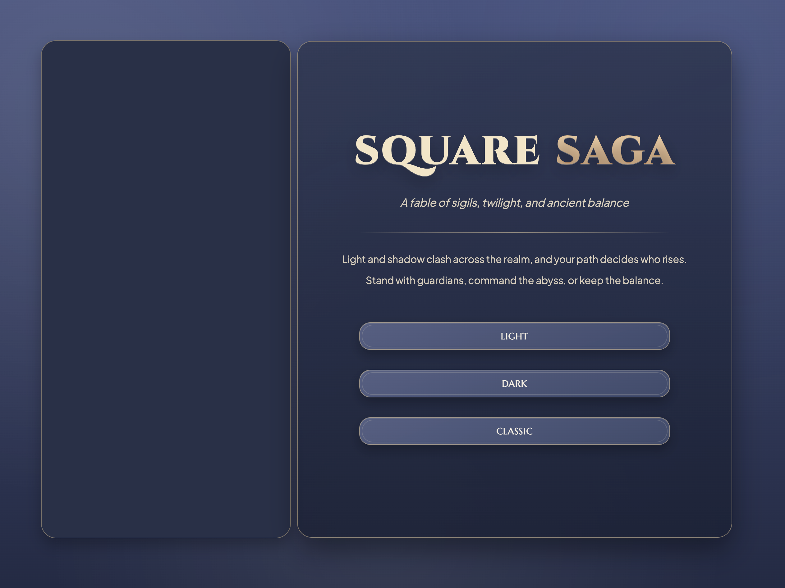
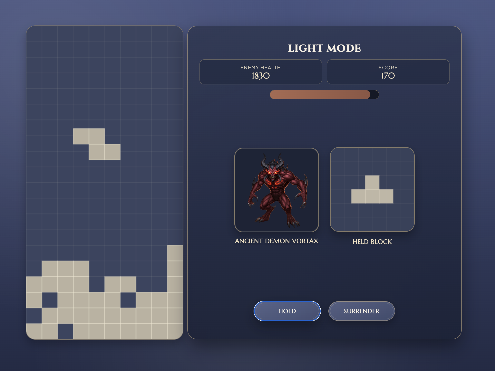
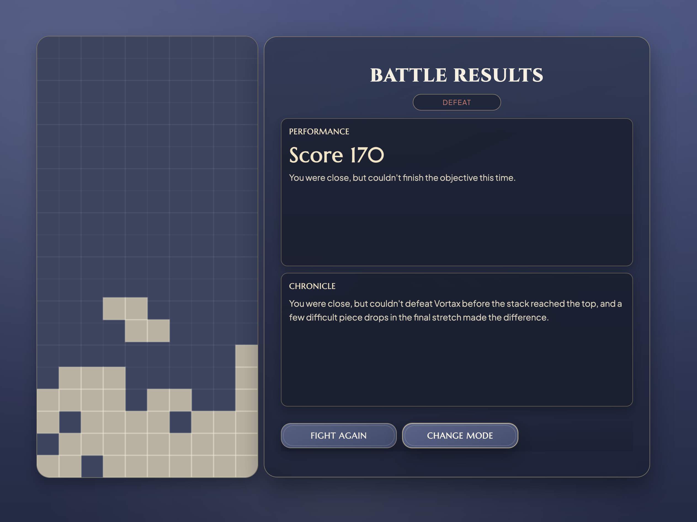

# Square Saga

A modern re-imagining of the classic Tetris game, featuring fundamental Tetris mechanics enhanced with advanced features, immersive lore, and multiple game modes. Square Saga transforms the traditional block-falling puzzle into an epic battle between light and darkness.

## Overview

Square Saga is a Tetris-like puzzle game that combines classic gameplay mechanics with modern enhancements. Players can choose between three distinct game modes, each offering a unique experience with its own narrative and visual theme. The game features smooth animations, responsive controls, and an engaging user interface that enhances the traditional Tetris experience.

## Key Features

### Core Gameplay

- **Classic Tetris Mechanics**: Familiar block-falling, rotation, and line-clearing gameplay
- **10 Unique Block Types**: Including traditional Tetris pieces plus custom variations
- **Smooth Controls**: Responsive keyboard controls for movement, rotation, and soft drop

### Visual & Audio

- **Three Modes**: Classic, Light, and Dark modes
- **Modern UI Design**: Beautiful, modern interface with smooth animations
- **Hold Block System**: Strategic block storage with visual preview and point cost
- **Multiple Game Modes**: Three distinct experiences with unique narratives
- **Character Sprites**: Visual enemies (Ancient Demon Vortax, Sacred Aura-Giving Tree)

### Story & Lore

- **Epic Narrative**: Rich backstory about the eternal battle between light and darkness
- **Character Context**: Players take on different roles as saviors, conquerors, or classic players based on mode selection
- **Immersive Descriptions**: Narrative text throughout the UI creates a more engaging gaming experience

## Game Modes

### Classic Mode

- **Objective**: Traditional Tetris gameplay
- **Goal**: Clear as many lines as possible
- **Scoring**: Points for blocks placed and lines cleared
- **End Condition**: Game ends when blocks reach the top

### Light Mode

- **Objective**: Champion the forces of light and protect the universe
- **Story**: Defeat the ancient demon Vortax by clearing rows of blocks
- **Mechanics**: Health system (2000 points to win)
- **Theme**: Bright, radiant color scheme
- **Challenge**: Strategic use of hold mechanic while managing Vortax's healing
- **Role**: You are the universe's salvation, fighting for justice and peace

### Dark Mode

- **Objective**: Master the shadows and achieve ultimate conquest
- **Story**: Destroy the sacred Aura-Giving Tree to claim dominion over the universe
- **Mechanics**: Aura system (2000 points to win)
- **Theme**: Dark, mysterious color scheme with shadow aesthetics
- **Challenge**: Balance between aggression and strategy while managing the tree's aura restoration
- **Role**: You are the harbinger of darkness, seeking ultimate power and dominion

## How to Play

### Controls

- **← → Arrow Keys**: Move blocks left and right
- **↑ Arrow Key**: Rotate blocks
- **↓ Arrow Key**: Soft drop
- **Hold Button**: Save current block for later use (shows as "Reserved Power")
- **Surrender Button**: Quit current game

### Gameplay Mechanics

1. **Block Placement**: Guide falling blocks to create complete horizontal lines
2. **Line Clearing**: Complete rows disappear and award points
3. **Hold Strategy**: Use the hold function to save useful blocks
4. **Score Building**: Earn points for blocks placed and lines cleared
5. **Mode Objectives**: Achieve mode-specific goals (Classic: survive, Light/Dark: reach 2000 points)

### Scoring System

- **Block Placement**: +20 points per block
- **Line Clear**: +100 points per line
- **Hold Cost**: -50 points per hold use
- **Mode Victory**: Reach 2000 points (Light/Dark modes)

## Installation & Setup

### Prerequisites

- Modern web browser (Chrome, Firefox, Safari, Edge)
- No additional software required

### Quick Start

1. **Clone the repository**:

   ```bash
   git clone https://github.com/yourusername/Square_Saga.git
   cd Square_Saga
   ```

2. **Open the game**:
   - Double-click `game.html` to open in your browser
   - Or serve the files using a local web server

3. **Start playing**:
   - Choose a mode from the main menu
   - Review the mode lore/rules screen
   - Enter battle and begin your journey

### Local Development Server (Optional)

If you prefer to run a local server:

```bash
# Using Python 3
python -m http.server 8000
```

Then navigate to `http://localhost:8000` in your browser.

## Technical Details

## Screenshots

### Home Screen



### Gameplay Screen



### End Screen



### Architecture

- **Frontend**: Pure HTML5, CSS3, and JavaScript
- **Rendering**: HTML5 Canvas for game graphics
- **State Management**: JavaScript-based game state
- **UI Framework**: Custom CSS

### File Structure

```
Square_Saga/
├── game.html          # Main HTML file with UI structure
├── game.js            # Core game logic and rendering
├── ui.js              # User interface management
├── images/            # UI screenshots and menu artwork
│   ├── home_screen.png
│   ├── game_screen.png
│   └── end_screen.png
├── assets/            # In-game character art
│   ├── monster_saga.png    # Demon Vortax sprite for Light Mode
│   └── tree_saga.png       # Aura-Giving Tree sprite for Dark Mode
└── README.md          # This file
```

### Key Components

#### `game.html`

- Main HTML structure
- CSS styling and animations
- UI layout and responsive design
- Google Fonts integration

#### `game.js`

- Block generation and movement
- Collision validation and overlap-safe placement checks
- Line clearing logic
- Canvas rendering with per-square outlines
- Game loop management

#### `ui.js`

- Screen state management
- Menu navigation and transitions (mode, about, gameplay, results)
- Dual-metric HUD updates (objective + score)
- Hold functionality and hold-penalty feedback
- Game mode selection and rule content
- Victory/defeat messaging and results screen content

### Technologies Used

- **HTML5 Canvas**: Game rendering and graphics
- **CSS3**: Styling, animations, and responsive design
- **JavaScript (ES6+)**: Game logic and interactivity
- **Google Fonts**: Typography (Cinzel, Marcellus, Plus Jakarta Sans)

## Acknowledgments

- **Tetris**: Original game concept by Alexey Pajitnov and the Tetris Company
